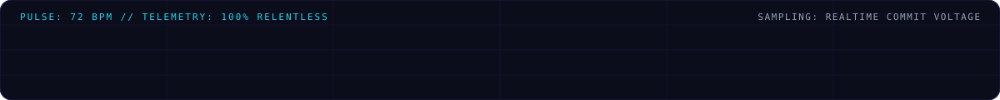

  

<!-- Social & Telemetry Badges -->

 

  

> 🚀 **AI / ML Systems Engineer · High-Performance Backends · Computer Vision**  
> ⚡ *Architecting intelligent AI models, real-time biometric pipelines & distributed computing systems.*

 

<!-- 01 // ABOUT ME -->

 

<!-- 02 // FEATURED SYSTEMS -->

  
  
  
  
  
  

<b>⚡ Expand: More Engineering Projects &amp; Experiments</b>

 

| Project | Domain | Architecture / Stack | Status |
|:--|:--|:--|:--:|
| [AI-Personal-Fitness-and-Diet-Coach](https://github.com/Yuvika687/AI-Personal-Fitness-and-Diet-Coach) | Generative AI / Health | Python · LLMs · Streamlit · Nutrition Engine | Production |
| [Recursion-Xray](https://github.com/Yuvika687/Recursion-Xray) | Developer Tools / Compilers | JavaScript · Call Stack Visualizer · AST | Active |
| [FWI-Predictor](https://github.com/Yuvika687/FWI-Predictor) | Environmental ML | Scikit-Learn · Flask · Climate Regression | Complete |
| [Artificial-Bee-Colony-Optimisation](https://github.com/Yuvika687/Artificial-Bee-Colony-Optimisation-for-resource-allocation) | Metaheuristic Algorithms | Python · Swarm Intelligence · Resource Alloc | Complete |
| [MemoVault](https://github.com/Yuvika687/MemoVault) | Security &amp; Storage | Cryptography · Node.js · Vault Engine | Secured |

 

<!-- 03 // TECH STACK -->

 

  

 

<!-- 04 // ALGORITHMIC COMBAT & DSA -->

> *"Consistency over intensity. Solve, analyze, master, repeat."*  
> ⚔️ Continuous deliberate practice across **Dynamic Programming**, **Graphs**, **Binary Search**, and **High-Performance C++**.

 

  

<!-- 05 // TELEMETRY & LIVE METRICS -->

 

  
  

<!-- Snake Contribution Grid Animation -->
<picture>
  <source media="(prefers-color-scheme: dark)" srcset="https://raw.githubusercontent.com/Yuvika687/Yuvika687/output/github-contribution-grid-snake-dark.svg" />
  <source media="(prefers-color-scheme: light)" srcset="https://raw.githubusercontent.com/Yuvika687/Yuvika687/output/github-contribution-grid-snake.svg" />
  
</picture>

  

<!-- 06 // CONNECT & TRANSMISSION -->

