<!-- All visuals are generated by .github/scripts/build_assets.py (static) and gen_stats.py (live data, rebuilt every 6h by Actions). -->

 

   

 

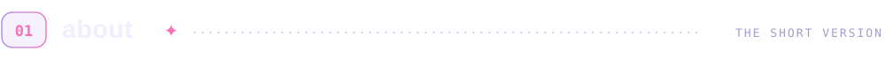

 

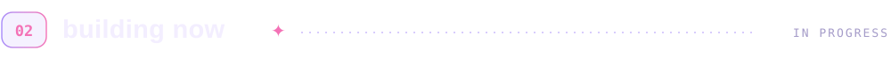

<a href="https://github.com/Yuvika687/OptiLLM"></a>

 

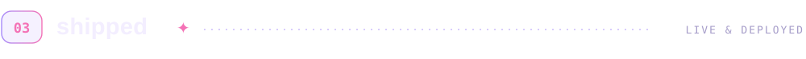

<a href="https://code-shelf-eight.vercel.app"></a>

<a href="https://code-shelf-eight.vercel.app">live app</a> · <a href="https://github.com/Yuvika687/CodeShelf">source</a> · web + mobile · JWT auth · tag search · scheduled reminder emails

 

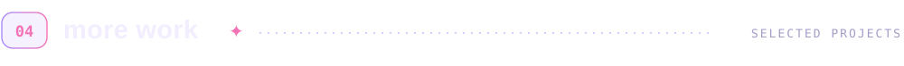

  <a href="https://github.com/Yuvika687/Unsupervised-Crowd-Density-Segmentation-for-Public-Event-Safety"></a>
  
  <a href="https://github.com/Yuvika687/AI-Personal-Fitness-and-Diet-Coach"></a>

<b>➕ a few more</b>

 

| Project | What it is |
|:--|:--|
| [FWI-Predictor](https://github.com/Yuvika687/FWI-Predictor) | Forest Fire Weather Index regression — EDA, VIF, linear and ridge models |
| [LeetCode_solutions](https://github.com/Yuvika687/LeetCode_solutions) | Problems grouped by pattern, in C++ and Python |
| [Artificial Bee Colony](https://github.com/Yuvika687/Artificial-Bee-Colony-Optimisation-for-resource-allocation) | ABC metaheuristic applied to resource allocation |
| [Portfolio](https://yuvika.vercel.app) | My personal site |

 

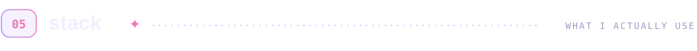

 

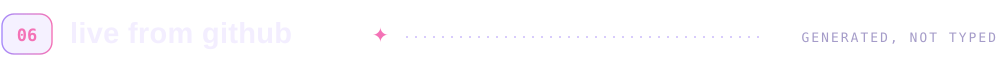

<picture>
  <source media="(prefers-color-scheme: dark)" srcset="https://raw.githubusercontent.com/Yuvika687/Yuvika687/output/github-contribution-grid-snake-dark.svg" />
  <source media="(prefers-color-scheme: light)" srcset="https://raw.githubusercontent.com/Yuvika687/Yuvika687/output/github-contribution-grid-snake.svg" />
  
</picture>

 

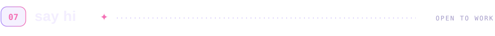
<a href="mailto:yuvikamalhotra1414@gmail.com"></a>

