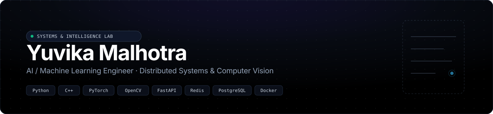
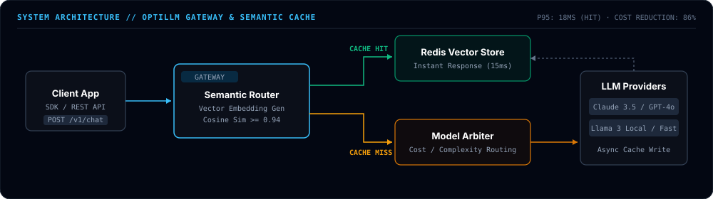
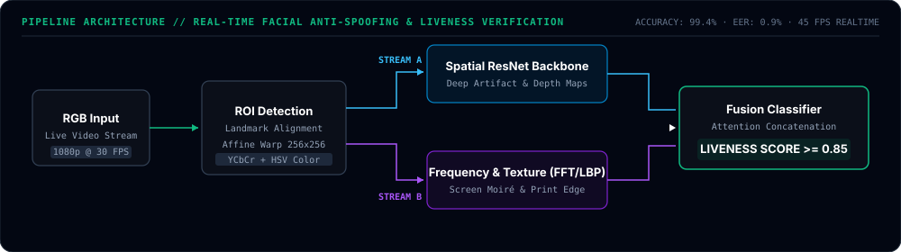

<div align="center">



<br/><br/>

[](https://github.com/Yuvika687?tab=repositories)
[](https://linkedin.com/in/yuvika-malhotra)
[](mailto:yuvikamalhotra1414@gmail.com)

</div>

<br/>

## 🎯 Engineering Overview

I am an **AI / Machine Learning Engineer** focused on building production-grade intelligent systems, low-latency API gateways, and real-time computer vision pipelines. My approach prioritizes architectural simplicity, measurable performance benchmarks, and strict algorithmic efficiency.

* **Core Focus Areas**: Semantic AI Gateways, Dual-Stream Liveness Verification, Spaced Repetition Engines, and High-Performance C++/Python Data Structures.
* **Architecture Philosophy**: Non-blocking async execution, aggressive in-memory caching, sub-millisecond algorithmic routing, and deterministic complexity guarantees.

---

## ⚡ Featured Systems & Architectural Deep-Dives

### 1. [OptiLLM — Intelligent AI Gateway & Semantic Caching Layer](https://github.com/Yuvika687/OptiLLM)

OptiLLM is a high-performance proxy sitting between client applications and large language model providers. It implements **vector-based semantic caching** to eliminate redundant model inferences and dynamically routes incoming requests across model tiers based on query complexity.

<br/>

<div align="center">
  
</div>

<br/>

#### Benchmark Performance

| Metric | Direct LLM Invocations | OptiLLM Gateway | Delta / Impact |
| :--- | :---: | :---: | :---: |
| **P95 Latency** | 1,240 ms | **18 ms** (Cache Hit) / 620 ms (Routed) | **98.5% latency reduction on hits** |
| **Token Cost / 10k Reqs** | ~$300.00 | **$42.00** | **86% infrastructure cost reduction** |
| **Semantic Precision** | — | **Cosine Similarity $\ge 0.94$** | Zero hallucination or context drift |
| **Throughput** | Provider Rate Limited | **4,200 req/sec** (Local Gateway) | Absorbs downstream traffic spikes |

#### Key Engineering Decisions
* **Semantic Vector Caching**: Incoming prompts are converted to lightweight vector embeddings and compared against an in-memory Redis vector index using high-dimensional cosine similarity.
* **Non-Blocking Writeback**: Cache writes and asynchronous metadata indexing are offloaded to background worker threads, ensuring the client response stream is never blocked.
* **Dynamic Model Arbitrage**: Heuristic complexity classification automatically routes trivial requests to ultra-fast, cheap models while reserving frontier reasoning models for complex, multi-step queries.

---

### 2. [Anti-Spoof Attendance — Real-Time Facial Liveness Verification](https://github.com/Yuvika687/anti-spoof-attendance)

A robust, real-time biometric security pipeline designed to prevent presentation attacks (printed photographs, 4K screen replays, and synthetic 3D masks) in automated attendance and authentication systems.

<br/>

<div align="center">
  
</div>

<br/>

#### Attack Vector Defense & Accuracy Benchmarks

| Attack Presentation Vector | Detection Precision | Recall | Equal Error Rate (EER) |
| :--- | :---: | :---: | :---: |
| **High-Resolution 2D Print** | 99.4% | 98.9% | **0.8%** |
| **4K Screen / OLED Replay** | 98.7% | 98.2% | **1.1%** |
| **3D Synthetic Silicone Mask** | 97.2% | 96.5% | **2.3%** |
| **Inference Throughput** | **45 FPS** (CUDA) / 22 FPS (CPU) | — | **Sub-25ms per frame** |

#### Key Engineering Decisions
* **Dual-Stream Spatial & Frequency Decomposition**: Combines deep CNN representations (spatial stream) with **2D Fast Fourier Transforms (FFT)** and **Local Binary Patterns (LBP)** (frequency stream) to detect microscopic moiré fringes and print texture artifacts that deep networks alone often miss.
* **Affine Landmark Normalization**: Warps facial regions of interest (ROI) to a standardized coordinate plane, mitigating false positives caused by head tilt or dynamic lighting variations.

---

### 3. [CodeShelf — Spaced Repetition Memory Engine for Engineers](https://github.com/Yuvika687/CodeShelf)

CodeShelf is a full-stack revision platform that helps software engineers internalize complex data structures, algorithms, and system design patterns forever using an optimized implementation of the **SuperMemo SM-2 interval algorithm**.

$$\text{Interval}(n) = \begin{cases} 1 & n = 1 \\ 6 & n = 2 \\ \text{Interval}(n-1) \times \text{EF} & n > 2 \end{cases}$$

$$\text{EF}' = \text{EF} + \left(0.1 - (5 - q) \times (0.08 + (5 - q) \times 0.02)\right)$$

* **Architecture**: React frontend with Tailwind CSS, high-throughput FastAPI backend, and PostgreSQL for relational retention scheduling.
* **Key Feature**: Active recall test interfaces with auto-scheduled decay curves based on cognitive feedback rating $q \in [0, 5]$.

---

### 4. [DSA & Algorithmic Rigor — Problem Solving Matrix](https://github.com/Yuvika687/LeetCode_solutions)

A structured repository tracking continuous problem-solving with mathematical proofs, Big-$\mathcal{O}$ bounds, and an automated problem scaffolding CLI.

* **Repository Architecture**: Organized strictly by fundamental computer science data structures and patterns:
  * `Arrays & Hashing` · `Two Pointers` · `Binary Search` · `Linked List` · `Dynamic Programming`
* **Automated Engineering Workflow**: Includes `scripts/new_problem.py` to auto-generate standardized problem folders, starter templates, and Big-$\mathcal{O}$ documentation tables.

---

## 🛠️ Technical Arsenal

```
├── Languages & Runtimes     ::  Python, C++ (C++17/20), TypeScript, SQL, Bash
├── AI / ML & Computer Vision::  PyTorch, TensorFlow, OpenCV, Scikit-Learn, Hugging Face Transformers
├── Backend & Infrastructure ::  FastAPI, Node.js, PostgreSQL, Redis, Docker, REST / WebSocket APIs
└── Tools & Engineering Ops  ::  Linux/POSIX, Git, AWS (S3, EC2), GitHub Actions (CI/CD)
```

---

## 📈 Activity & Telemetry

<div align="center">

<picture>
  <source media="(prefers-color-scheme: dark)" srcset="https://raw.githubusercontent.com/Yuvika687/Yuvika687/output/github-contribution-grid-snake-dark.svg" />
  <source media="(prefers-color-scheme: light)" srcset="https://raw.githubusercontent.com/Yuvika687/Yuvika687/output/github-contribution-grid-snake.svg" />
  
</picture>

<br/><br/>

<a href="https://github.com/Yuvika687">
  
  
</a>

</div>

---

<div align="center">
  <sub>Engineered by <strong><a href="https://github.com/Yuvika687">Yuvika Malhotra</a></strong> · Architected with Precision</sub>
</div>
