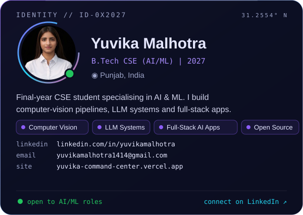
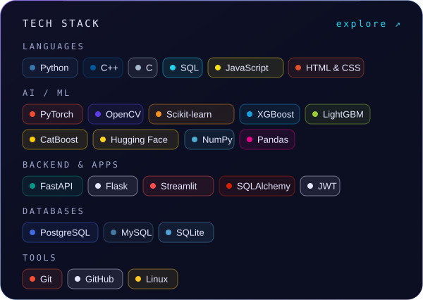

<!--
  Command Center README (preview branch).
  Static art: .github/scripts/command_center.py static --out assets/cc
  Live cards (status / now building / projects) and the link list below are rebuilt every 6h by profile-build.yml.
-->

<a href="https://yuvika-command-center.vercel.app">
  <picture>
    <source media="(prefers-color-scheme: dark)" srcset="./assets/cc/hero-dark.svg" />
    <source media="(prefers-color-scheme: light)" srcset="./assets/cc/hero-light.svg" />
    
  </picture>
</a>

<!-- NOW:START -->

<!-- NOW:END -->

  
  

<b>Every project</b> — generated from GitHub, newest first

 

<!-- PROJECTS:START -->
| Project | What it is | Language | Stars |
|:--|:--|:--|--:|
| [**command-center**](https://github.com/Yuvika687/command-center) | Yuvika Malhotra's developer Command Center — an interactive workspace on live GitHub data | TypeScript | ★ 0 |
| [**OptiLLM**](https://github.com/Yuvika687/OptiLLM) | Intelligent AI gateway: semantic cache, model routing, and cost analytics | HTML | ★ 0 |
| [**CodeShelf**](https://github.com/Yuvika687/CodeShelf) | CodeShelf — spaced repetition revision engine for developers | Python | ★ 0 |
| [**LeetCode_solutions**](https://github.com/Yuvika687/LeetCode_solutions) | LeetCode solutions organised by algorithmic pattern, with complexity analysis — C++ and Python | Python | ★ 0 |
| [**Fake-twitter-account-detection-using-supervised-ML**](https://github.com/Yuvika687/Fake-twitter-account-detection-using-supervised-ML) | Supervised ML bot detector for Twitter/X accounts — XGBoost ensemble (AUC 0.946), FastAPI inference, Streamlit dashboard | Python | ★ 0 |
| [**Unsupervised-Crowd-Density-Segmentation-for-Public-Event-Safety**](https://github.com/Yuvika687/Unsupervised-Crowd-Density-Segmentation-for-Public-Event-Safety) | SafeCrowd Vision — real-time crowd density estimation and unsupervised zone-risk segmentation for public event safety | Python | ★ 0 |
| [**Yuvika-Portfolio**](https://github.com/Yuvika687/Yuvika-Portfolio) | My previous portfolio site (HTML, CSS, JavaScript) | CSS | ★ 0 |
| [**AI-Personal-Fitness-and-Diet-Coach**](https://github.com/Yuvika687/AI-Personal-Fitness-and-Diet-Coach) | 🏋️ Your AI-powered personal coach that plans workouts, tracks habits,  analyzes diet &amp; gives real-time fitness guidance — all in one place! 💪🤖 | JavaScript | ★ 1 |
| [**FWI-Predictor**](https://github.com/Yuvika687/FWI-Predictor) | Forest Fire Weather Index prediction — EDA, outlier handling, linear and ridge regression | Jupyter Notebook | ★ 0 |
| [**Artificial-Bee-Colony-Optimisation-for-resource-allocation**](https://github.com/Yuvika687/Artificial-Bee-Colony-Optimisation-for-resource-allocation) | Artificial Bee Colony metaheuristic applied to resource allocation | HTML | ★ 0 |
<!-- PROJECTS:END -->

<picture>
  <source media="(prefers-color-scheme: dark)" srcset="https://raw.githubusercontent.com/Yuvika687/Yuvika687/output/github-contribution-grid-snake-dark.svg" />
  <source media="(prefers-color-scheme: light)" srcset="https://raw.githubusercontent.com/Yuvika687/Yuvika687/output/github-contribution-grid-snake.svg" />
  
</picture>

  
  
  
  

